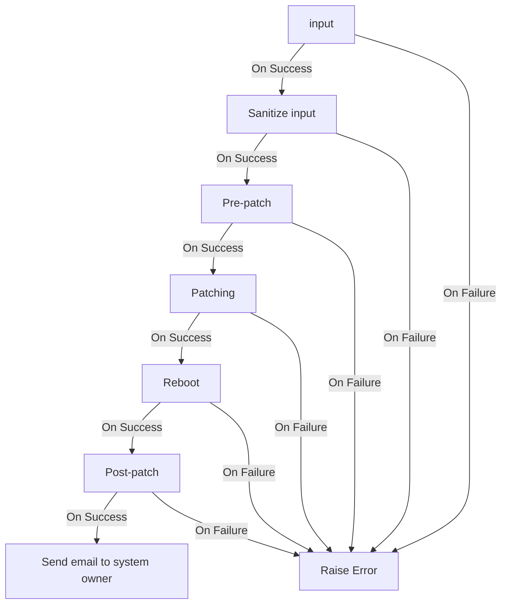

# WORKFLOWS

## Patch Workflow

### Credentials

email:

- password
- smtp server
- email address

### Variables

- input choices
- pre-patch choices
- patch choices
- reboot choices
  - direct
  - write facts in inventory
- post-patch choices
- email and message choices

### Playbooks

- [ ] Playbook to create workflow in AAP
- [ ] Job Template Sanitize input
- [ ] Job Template Pre-patch reqs and checks
- [ ] Job Template Patching
- [ ] Job Template Reboot system
- [ ] Job Template Post-patching checks
- [ ] Job Template Send email to system owner

### Overview

