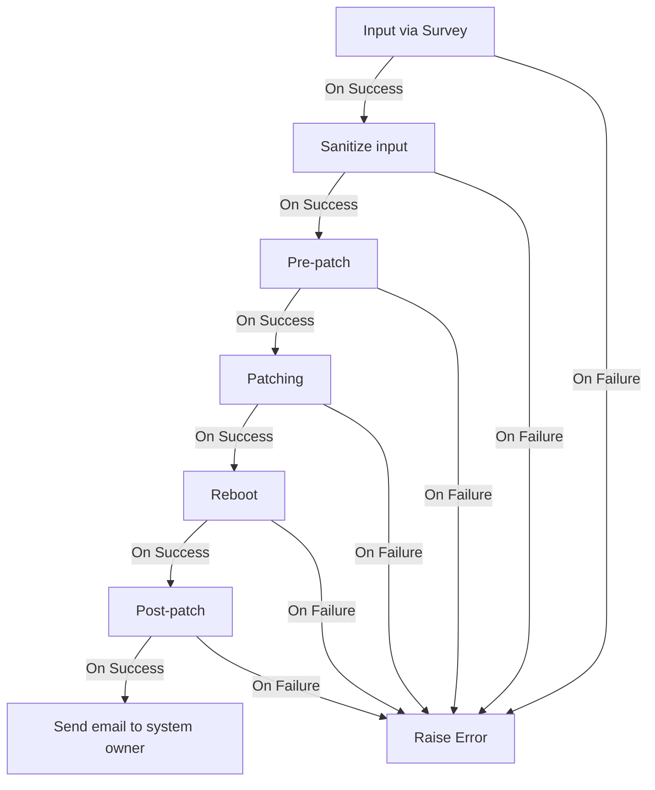

# WORKFLOWS

## Patch Workflow

To create the Patch Workflow run:

``` bash
ansible-playbook -e @vars_aap.yml -e @secrets/vault.yml playbooks/create_patch_workflow.yml -v --ask-vault-pass
```

### Vault variables

Create a vault for the secrets needed in the Patch Workflow.

SMTP Credentials

``` yaml
vault_workflow_smtp_password: <SMTP_PASSWORD>
vault_workflow_smtp_email: <SMTP_EMAIL>
```

Machine Credentials

``` yaml
vault_workflow_machine_username: <MACHINE_PASSWORD>
vault_workflow_machine_private_key: <MACHINE_PRIVATE_KEY>
```

### Credentials

email:

- password
- smtp server
- email address

### Variables

- input choices
- pre-patch choices
- patch choices
- reboot choices
  - direct
  - write facts in inventory
- post-patch choices
- email and message choices

### Playbooks

- Playbook to create workflow in AAP
- Job Template Sanitize input
- Job Template Pre-patch reqs and checks
- Job Template Patching
- Job Template Reboot system
- Job Template Post-patching checks
- Job Template Send email to system owner

- [create_patch_workflow.yml](playbooks/create_patch_workflow.yml)
- [patch_wf_on_failure.yml](playbooks/patch_wf_on_failure.yml)
- [patch_wf_patch_system.yml](playbooks/patch_wf_patch_system.yml)
- [patch_wf_post_patching_checks.yml](playbooks/patch_wf_post_patching_checks.yml)
- [patch_wf_pre_patching_checks.yml](playbooks/patch_wf_pre_patching_checks.yml)
- [patch_wf_reboot_system.yml](playbooks/patch_wf_reboot_system.yml)
- [patch_wf_sanitize_input.yml](playbooks/patch_wf_sanitize_input.yml)
- [patch_wf_send_email.yml](playbooks/patch_wf_send_email.yml)
- [ping.yml](playbooks/ping.yml)
- [test_aap.yml](playbooks/test_aap.yml)

### Overview


